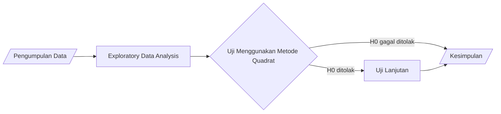

# Spatial Statistics

> **Disclaimer :**
>
> This project is for educational purposes.
>
> **Credits :**
> 1. Benedicta Winni Lisachristanty
> 2. Dea Kristina
> 3. Fria Nurul Hidayat
> 4. Yudhistira Jinawi Agung

# Abstrak
Perubahan gaya hidup masyarakat menjadi *coffee society* meningkatkan jumlah usaha *coffee shop* di Indonesia. Pada penelitian ini, akan dilihat persebaran *coffee shop* di salah satu epicentrum (JABODETABEK), yaitu Kota Depok dengan menggunakan metode Quadrat. Metode ini digunakan untuk melihat apakah *coffee shop* di Kota Depok tersebar secara merata (CSR) atau terkluster/reguler (*uniform*). Hasil penelitian dapat membantu calon pengusaha *coffee shop* dalam menentukan tempat terbaik di Kota Depok untuk memulai usaha mereka.

# Latar Belakang
Pada era ini, masyarakat khususnya *millenial* mengalami perubahan gaya hidup menjadi *coffee society*. Berdasarkan riset yang dilakukan oleh Toffin, usaha *coffee shop* di Indonesia mengalami peningkatkan hingga mencapai 2950 gerai (Agustus 2019). Hal ini diperkuat dengan Data Tahunan Konsumsi Kopi di Indonesia mencapai 294000 ton (Global Agricultural Information Network, 2019) sehingga menimbulkan persaingan usaha *coffee shop* khususnya di Kota Depok yang merupakan salah satu *epicentrum* (JABODETABEK). Maka dari itu, penelitian ini akan melihat persebaran *coffee shop* di Kota Depok pada tahun 2022.

# Tujuan
1. Untuk mengetahui persebaran *coffee shop* di Kota Depok.
2. Untuk mengestimasi bagaimana variasi intensitas pola titik *coffee shop* di Kota Depok.
3. Untuk mengetahui apakah persebaran *coffee shop* di Kota Depok memenuhi *Complete Spatial Randomness* (CSR) atau tidak.

# Hipotesis
Penulis mengajukan hipotesis bahwa data persebaran *coffee shop* yang terdapat di Kota Depok tersebar acak secara spasial. Hipotesis tersebut akan diuji dengan menggunakan metode Quadrat.

# Metode
Untuk mengetahui pola titik dari sebaran *coffee shop* di Kota Depok, akan digunakan **metode Quadrat** untuk mengambil keputusan apakah persebaran *coffee shop* di Kota Depok memenuhi CSR atau tidak.

# Data
[Data](bit.ly/DataSpasialKelompokH) yang digunakan merupakan **data sekunder** (sumber: Google Earth). Data terdiri dari **75 *coffee shop*** yang berada di Kota Depok.

Berikut gambaran data terkait *coffee shop* di Kota Depok.

| *Coffee Shop* | Longitude | Latitude |
| :--- | :---: | :---: |
| Nezcoffee | 106.85552 | -6.4464205 |
| Kedai Kopi Verbena | 106.8329759 | -6.4450751 |
| Meeting Point Coffee | 106.8321539 | -6.4434771 |
| Annur Caffe | 106.7785893 | -6.4340765 |
| Coffee Shop Adank | 106.8089931 | -6.4267495 |
| Zona Nyaman Kopi | 106.765207 | -6.4242934 |

# Langkah-langkah Kerja

# Hasil dan Pembahasan
## Uji Quadrat

  
   
  <i>Gambar 1 Quadrat Method Plot</i>

  
   
  <i>Gambar 2 Intensity Plot</i>

**Hipotesis:**

$H_0$ : Data menunjukkan *Complete Spatial Randomness* (CSR)
$H_1$ : Data terkluster atau tersebar secara spasial

Dengan menggunakan rumus CSR, didapatkan nilai statistik uji sebesar 141.41. Pada tingkat kepercayaan 95% diperoleh bahwa $\chi ^{2}$ > $\chi ^{2}_{0.05; 78}$ dan $p-value < 0.05$, maka dapat disimpulkan $H_0$ ditolak sehingga **data terkluster atau tersebar secara spasial**.

## Uji Lanjutan
Dikarenakan pengujian dengan metode Quadrat disimpulkan $H_0$ ditolak, maka akan digunakan uji lanjutan sebagai berikut.

| Index | Estimator |
| :--- | :---: |
| Relative Variance $(I)$ | 2.995214 |
| Index of Cluster Size $(ICS)$ | 1.995213 |
| Index of Cluster Frequency $(ICF)$ | 0.4758223 |

Berdasarkan uji lanjutan didapatkan $I>1$ dan $ICS>0$, maka dapat disimpulkan bahwa **data terindikasi kluster**.

# Kesimpulan
Dari pengujian di atas, diperoleh hasil bahwa data tersebar secara spasial. Dapat dilihat juga pada gambar *Plot Quadrat Methods* dan uji lanjutan bahwa kecenderungan *coffee shop* yang diteliti terpusat di Kota Depok dimana hal ini diperkuat dengan uji lanjutan yang didapatkan bahwa data merupakan data kluster.

# Saran
1. Untuk para wirausaha yang ingin membangun bisnis *coffee shop* di kota Depok, disarankan agar mengambil lokasi yang tidak terlalu berada di pusat kota Depok, dikarenakan tingkat persaingan akan lebih rendah dan dapat menjangkau masyarakat-masyarakat yang berada di pinggiran kota Depok. Namun pemilihan tempat usaha ini juga harus mempertimbangkan faktor-faktor lainnya yang mungkin berpengaruh, sehingga diperlukan analisis lebih lanjut.
2. Untuk peneliti dimasa yang akan datang, dapat dilihat pula aspek-aspek lainnya yang mendukung pembukaan *coffee shop* di pinggiran kota Depok, apakah terdapat variabel lainnya yang dapat mempengaruhi keramaian dari *coffee shop*.

# Referensi
1. C.Cressie, Noel A.1990. Statitics for Spatial Data. Iowa: Iowa States University.
2. Data dan Fakta Tren Menjamurnya Kedai Kopi Kekinian di Indonesia diakses melalui https://www.inews.id/travel/kuliner/data-dan-fakta-tren-menjamurnya-kedai-kopi-kekinian-di-indonesia.
3. Hasil Riset Kedai Kopi di Indonesia diakses melalui https://finance.detik.com/berita-ekonomi-bisnis/d-4826275/hasil-riset-kedai-kopi-di-ri-bertambah-2000-dalam-3-tahun.
4. Pemilihan Lokasi Usaha sebagai Salah Satu Strategi dalam Business Start diakses melalui https://binus.ac.id/malang/2017/06/pemilihan-lokasi-usaha-sebagai-salah-satu-strategi-dalam-business-start-up/.
5. Sejarah Kota Depok diakses melalui https://www.depok.go.id/sejarah.
6. Spatstat Documentation diakses melalui https://spatstat.org/resources/spatstatManual.pdf
7. Teori Statistika Spasial diakses melalui https://training.fws.gov/courses/references/tutorials/geospatial/CSP7304/documents/Lecture12_PointPat1.pdf